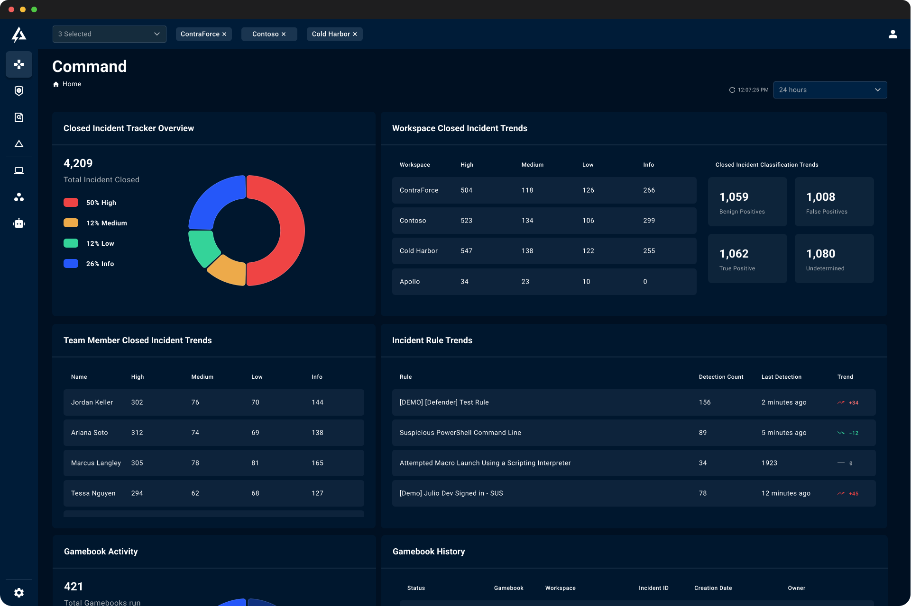

# Welcome to ContraForce

The ContraForce platform condenses your existing Microsoft security stack into a centralized dashboard that is easy to understand and even easier to deploy. Within the ContraForce portal, users can investigate and respond to incidents and build a holistic security program quickly and easily.

# ContraForce API Documentation

Below are links for ContraForce API documentation. This documentation covers the technical usage for all request types used in the ContraForce API

- [ContraForce API](https://github.com/ContraForce/contraforce-api/tree/main/Docs)
  - [Incident Object](https://github.com/ContraForce/contraforce-api/blob/main/Docs/incident-object.md)
  - [List Incidents Request](https://github.com/ContraForce/contraforce-api/blob/main/Docs/list-incidents.md)
  - [Get Incident Details Request](https://github.com/ContraForce/contraforce-api/blob/main/Docs/get-incident-details.md)
  - [List Incident Entities Request](https://github.com/ContraForce/contraforce-api/blob/main/Docs/list-incident-entities.md)
  - [List Incident Evidence Request](https://github.com/ContraForce/contraforce-api/blob/main/Docs/list-incident-evidence.md)
